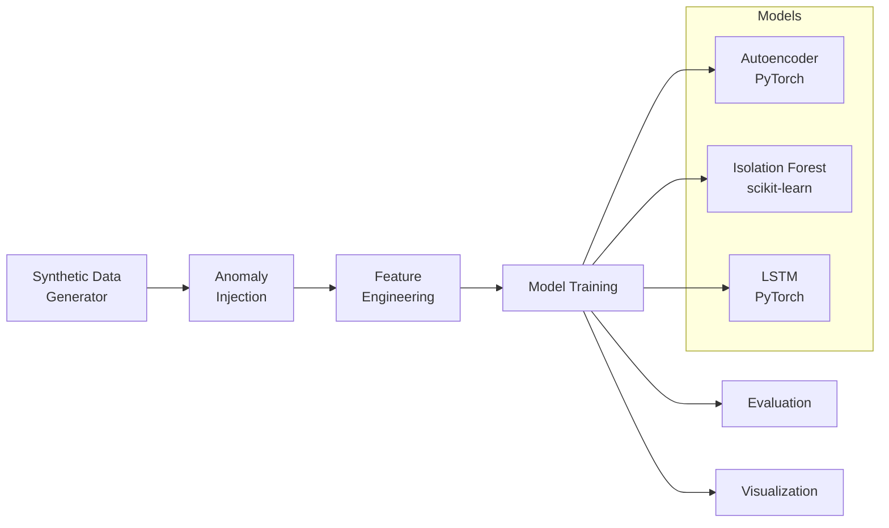
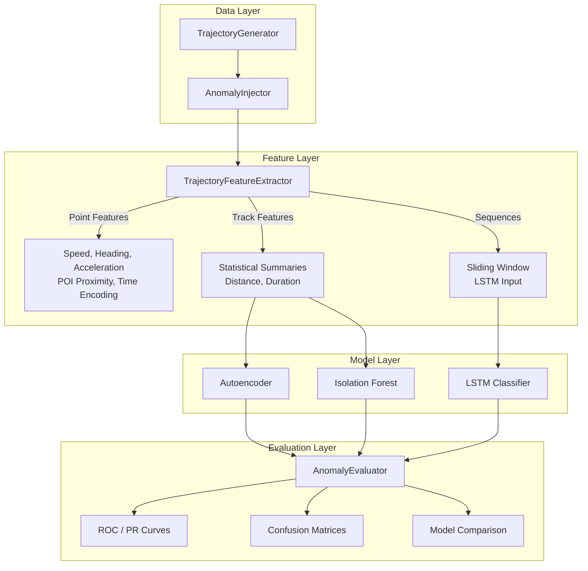

# Geospatial Anomaly Detection

Deep learning and classical ML approaches for detecting anomalous behaviors in geospatial trajectory data — vessel tracks, flight paths, and vehicle movements.

[](https://www.python.org/downloads/)
[](https://pytorch.org/)
[](https://opensource.org/licenses/MIT)

## Overview

This project implements a complete anomaly detection pipeline for geospatial intelligence applications. It generates synthetic movement data with injected anomalies, extracts spatial/temporal features, and trains multiple detection models for comparison.

### Pipeline



### Anomaly Types Detected

| Anomaly | Description | Real-World Analog |
|---------|-------------|-------------------|
| **Route Deviation** | Off-course movement with smooth displacement | Vessel deviating from shipping lanes |
| **Speed Anomaly** | Sudden acceleration or near-stop | Suspicious speed changes near restricted areas |
| **Loitering** | Circular pattern at unexpected location | Unauthorized anchorage or surveillance |
| **Dark Period** | Gap in position reports with location shift | AIS transponder shutoff to avoid tracking |

## Architecture



## Project Structure

```
geospatial-anomaly-detection/
├── README.md
├── pyproject.toml
├── requirements.txt
├── src/
│   ├── data_generation/
│   │   ├── generator.py      # Synthetic trajectory generation
│   │   └── anomalies.py      # Anomaly injection engine
│   ├── feature_engineering/
│   │   └── features.py       # Spatial/temporal feature extraction
│   ├── models/
│   │   ├── autoencoder.py    # Deep autoencoder (PyTorch)
│   │   ├── isolation_forest.py  # Isolation Forest baseline
│   │   └── lstm.py           # Bidirectional LSTM with attention
│   ├── visualization/
│   │   ├── maps.py           # Interactive folium maps
│   │   └── plots.py          # Evaluation charts (matplotlib/plotly)
│   └── evaluation/
│       └── metrics.py        # Metrics and model comparison
├── notebooks/
│   └── demo.ipynb            # Full pipeline walkthrough
├── tests/
│   ├── test_data_generation.py
│   ├── test_feature_engineering.py
│   └── test_models.py
└── docs/
    └── architecture.md
```

## Quick Start with Docker

The fastest way to run the full pipeline — no local Python setup required.

```bash
# Clone
git clone https://github.com/osth0006/geospatial-anomaly-detection.git
cd geospatial-anomaly-detection

# Run the anomaly detection pipeline
docker-compose up analysis

# Or launch the interactive Jupyter notebook
docker-compose up notebook
# Then open http://localhost:8888 in your browser
```

**Volume mounts:** The `data/` and `output/` directories are mounted into the container, so generated data and results persist on your host machine. The `notebooks/` directory is also mounted for the notebook service, so edits are saved locally.

## Quick Start (Local)

```bash
# Clone and install
git clone https://github.com/osth0006/geospatial-anomaly-detection.git
cd geospatial-anomaly-detection
pip install -e ".[dev]"

# Run the pipeline
python run_pipeline.py

# Run tests
pytest tests/ -v

# Launch the demo notebook
jupyter notebook notebooks/demo.ipynb
```

## Models

### 1. Autoencoder (PyTorch)

A deep autoencoder trained on normal trajectory features. Anomalies produce high reconstruction error.

- **Architecture**: Input → 64 → 32 → 12 (latent) → 32 → 64 → Input
- **Regularization**: Batch normalization, dropout
- **Detection**: Threshold on MSE reconstruction error (95th percentile of training errors)

### 2. Isolation Forest (scikit-learn)

Ensemble baseline that isolates anomalies via random recursive partitioning. Anomalies require fewer splits to isolate.

- **Estimators**: 200 trees
- **Preprocessing**: Standard scaling
- **Advantages**: No neural network training, fast inference, interpretable

### 3. LSTM Sequence Classifier (PyTorch)

Bidirectional LSTM with attention pooling for trajectory sequence classification.

- **Architecture**: Bidirectional LSTM (2 layers, hidden=64) → Attention → FC → Sigmoid
- **Input**: Sliding windows of 30 timesteps × 8 features
- **Class Balancing**: Weighted BCE loss to handle anomaly rarity

## Feature Engineering

### Point-Level Features
- **Kinematic**: Speed, acceleration, heading change, absolute heading change
- **Temporal**: Cyclical hour-of-day encoding (sin/cos), day-of-week encoding
- **Spatial**: Distance to 5 points of interest (ports, restricted areas, anchorages)
- **Statistical**: Per-track z-scores for speed and heading change

### Track-Level Features
- Mean, std, min, max of speed, acceleration, heading change
- Minimum and mean distance to each POI
- Total distance traveled, track duration, observation count

## Visualization

Interactive folium maps provide:
- **Track overlay**: Color-coded by entity type with anomalous segments highlighted
- **Anomaly heatmap**: Density visualization of detected anomalies
- **Detection map**: Side-by-side ground truth vs. model predictions (TP/FP/FN)

## Tech Stack

| Component | Technology |
|-----------|-----------|
| Deep Learning | PyTorch 2.0+ |
| Classical ML | scikit-learn 1.3+ |
| Data Processing | pandas, NumPy, GeoPandas |
| Geospatial | Shapely, folium |
| Visualization | matplotlib, seaborn, Plotly |
| Testing | pytest |

## License

MIT
